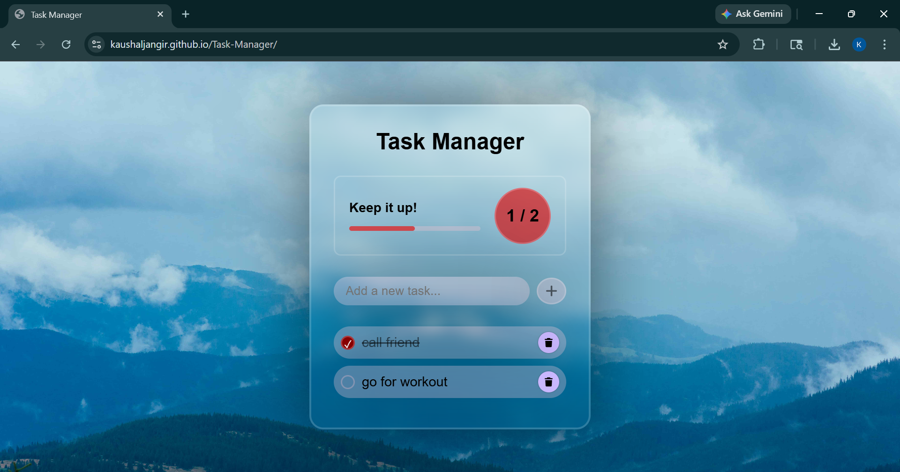

# 📝 Task Manager (To-Do List)

A simple and interactive Task Manager (To-Do List) web app built using HTML, CSS, and JavaScript.
It helps users manage daily tasks efficiently with a clean UI and useful features.

---

## 🚀 Features

* Add and delete tasks
* Mark tasks as completed
* Progress bar showing completion status
* LocalStorage support (tasks saved even after refresh)
* Confetti animation on completing all tasks
* Responsive and modern UI design

---

## 🛠️ Technologies Used

* HTML
* CSS
* JavaScript

---

## 📸 Screenshot

---

## 🔗 Live Demo

https://kaushaljangir.github.io/Task-Manager/

---

## 📌 How to Run

1. Download or clone the repository
2. Open `index.html` in your browser

---

## 🎯 Project Purpose

This project was built to practice JavaScript concepts like DOM manipulation, event handling, and localStorage, along with improving frontend UI skills.

---

## 👨‍💻 Author

**Kaushal Jangir**
